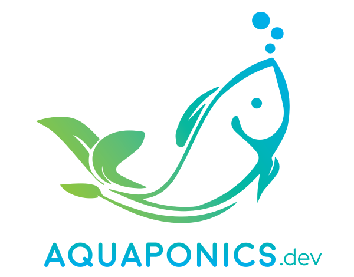

||Hi! My name is **Lorena**. Welcome to my digital garden. I am a PhD candidate at [Wageningen](https://www.wur.nl/en/about-wur.htm) working on making a tool to calculate the Return of Investment of Aquaponics endeavors. To do this, a lot of research material has to be read and digested. From fish, to micro-organisms, to plants, passing through finance and modelling.| 
|--------------|:-----:|

> [!info] What is the purpose for this website? 🐟💦🍃🌱
>
>This page is intended to share my notes on aquaponics and its adjacent subjects (which are a lot!). Do not expect a perfect order but a review of my takes on each article I digest, the classifications I deem important for my reasearch and my personal take on the article itself.     !

Even before I started my PhD I have been researching a lot about aquaponics and adjacent topics, I have ingested over a thousand articles, papers, books and videos. It is always hard to find what you want to find, either because it is bad quality, or it is not open access or even because there is just too much mess. When my reading started getting too messy I figured I needed a system to organize it and came across the concept of digital garden, personal knowledge management (PKM), zettelkasten, Zotero and Obsidian. With this in mind, I started cataloguing my notes and wondered how many other people have done the same, searched for specific literature related to specific topics. I figured I should put it out there so other people can start from a step above what I started. 
## More Info
 
If you´d like to see more about me you can go visit my personal website [LorenaSA.com](https://lorenasa.com). I also have a [Researchgate](https://www.researchgate.net/profile/Lorena-Silva-Araujo-3) where you can find my publications. 

>📓 My Master Thesis [Viability study of a high technology commercial aquaponics production system in São Paulo, Brazil](https://www.researchgate.net/publication/364368663_Viability_study_of_a_high_technology_commercial_aquaponics_production_system_in_Sao_Paulo_Brazil) 

>📗My first article [Making Aquaponics a Business: A Framework](https://www.mdpi.com/2073-4441/13/21/2978)

> 👷Currently working on [Review paper - Comparisons](/tags/ReviewPaper).

> More to come soon...

# Get Started
> 📚 Example of notes  [[zotero/abusinSustainableFoodProduction2020 - Extracted Annotations]]

> 🔎Use the search to find something specific
>
> If you prefer browsing the contents of this site through a list instead of a graph, you see a list of all [ReviewPaper-related notes](/tags/ReviewPaper).

test 
> If you prefer browsing the contents of this site through a list instead of a graph, you see a list of all [testing-related notes](/tags/testing).

Metadata
> If you prefer browsing the contents of this site through a list instead of a graph, you see a list of all [Meta-related notes](/tags/Meta/).

Unfinished
> If you prefer browsing the contents of this site through a list instead of a graph, you see a list of all [⭕-related notes](/tags/⭕).

If you'd like to reach me directly for any collaboration, suggestion, etc, don't hesitate. My email is 📧 lorena.silvaaraujo@wur.nl

